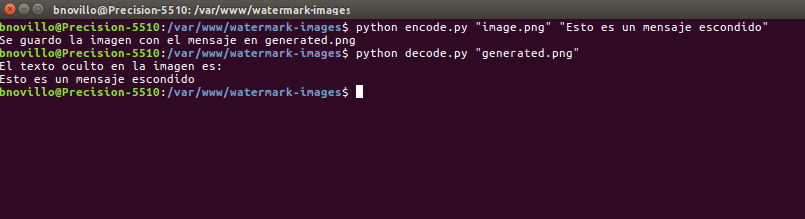

## Add hidden messages into image bytes as watermark



### Add hidden message into image
```
python3 encode.py "image.png" "Este es el mensaje para esconder"
```

### Discover message
```
python3 decode.py "generated.png"
```
